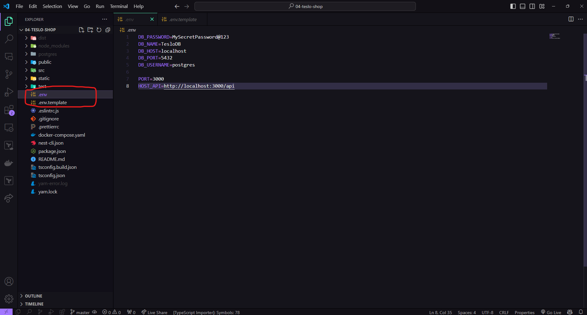

<p align="center">
  <a href="http://nestjs.com/" target="blank"></a>
</p>

<p align="center">
  Cascarón para crear backends en NestJS. Con ❤️ para <b>Estevez.Jor</b>
</p>

# Descripción General

Este repositorio sirve como un cascarón para proyectos de [NestJS](https://github.com/nestjs/nest). Proporciona una configuración inicial que incluye todas las dependencias y configuraciones necesarias para comenzar a desarrollar una aplicación con NestJS de manera eficiente.

El cascarón incluye:

- Configuración básica de NestJS
- Scripts de inicio y desarrollo
- Configuración de TypeScript
- Configuración de pruebas unitarias

Este cascarón está diseñado para ayudarte a acelerar el proceso de inicio de un nuevo proyecto, evitando la necesidad de configurar repetidamente los mismos ajustes para cada nuevo proyecto de NestJS.

Para comenzar a usar este cascarón, simplemente clona el repositorio, instala las dependencias con `yarn install` y comienza a desarrollar con `yarn start:dev`.

## Instalaciones Necesarias

- [**NVM**](https://github.com/nvm-sh/nvm#installing-and-updating): Gestor de versiones de Node.js. Permite instalar y usar múltiples versiones de Node.js en la misma máquina.

- **Node.js**: Entorno de ejecución para JavaScript. Puedes instalarlo usando NVM con el comando `nvm install node`.

- [**Docker Desktop**](https://www.docker.com/products/docker-desktop): Plataforma para desarrollar, enviar y ejecutar aplicaciones en contenedores. Necesario para ejecutar la base de datos en un contenedor Docker.

- [**Git**](https://git-scm.com/downloads): Sistema de control de versiones distribuido. Es esencial para el control de versiones y la colaboración en proyectos de desarrollo de software.

- [**Visual Studio Code**](https://code.visualstudio.com/download): Editor de código recomendado para este proyecto.

- [**Postman**](https://www.postman.com/downloads/) o [**Insomnia**](https://insomnia.rest/download): Herramienta para probar y documentar APIs. Es útil para probar las rutas y funciones de tu aplicación.

- [**TablePlus**](https://tableplus.com/download): Herramienta moderna, nativa y amigable para administrar bases de datos. Es útil para visualizar, editar y administrar tus datos en la base de datos.

## 1. Clonación del Repositorio

El primer paso para comenzar a trabajar con este proyecto es clonar el repositorio. Para hacerlo, abre una terminal en la ubicación donde deseas guardar el proyecto y ejecuta el siguiente comando:

```bash
git clone https://github.com/project-dev-estevez/nestjs-shell.git
```

## 2. Instalación de Dependencias

Una vez clonado el repositorio, el siguiente paso es instalar las dependencias del proyecto. Para hacerlo, navega a la carpeta del proyecto en la terminal y ejecuta el siguiente comando:

```bash
# Instalar Yarn de manera global
npm install -g yarn

# Instalar las dependencias con Yarn
yarn install
```
> **Nota:** Aunque también puedes usar `npm install` para instalar las dependencias, recomendamos usar `yarn` debido a su eficiencia y rapidez.


## 3. Variables de Entorno

Las variables de entorno son una forma de configurar la aplicación para diferentes entornos, permitiendo que los valores cambien según el entorno en el que se esté ejecutando la aplicación.

Este proyecto utiliza un archivo `.env` para definir las variables de entorno. Para configurar tus propias variables de entorno, sigue estos pasos:

1. Duplica el archivo `.env.template` en la raíz del proyecto.
2. Renombra el archivo duplicado a `.env`.
3. Cambia las variables de entorno en el archivo `.env` según tu caso.

El archivo `.env` no se debe subir al control de versiones, por lo que se ha añadido al archivo `.gitignore` para evitar subirlo accidentalmente.



> **Nota:** Las variables de entorno se configuraron con `ConfigModule` y se validaron con `joi`.

## 4. Base de Datos

Este proyecto utiliza PostgreSQL como sistema de gestión de bases de datos. Para facilitar el desarrollo, se incluye un archivo `docker-compose.yml` en la raiz del proyecto que configura un contenedor Docker con una imagen de PostgreSQL, también se encuetra comentado la configuración para levantar una base de datos MongoDB o MySQL.

Para iniciar la base de datos, asegúrate de tener Docker instalado y ejecutandose en tu máquina y luego, ubicado en el path del proyecto ejecuta el siguiente comando:

```bash
docker-compose up -d
```

## 5. Ejecutar el Proyecto

```bash
$ yarn start:dev
```

### Seeders de la Base de Datos

Los seeders son scripts que permiten poblar la base de datos con datos de prueba. Son útiles para probar la aplicación durante el desarrollo y para asegurarse de que ciertas condiciones de datos siempre se cumplan.

Este proyecto incluye seeders que puedes ejecutar para poblar tu base de datos con datos de prueba. Para cargar los seeders, realiza una solicitud GET a la siguiente URL:

```http
http://localhost:3000/api/v1/seed
```

## 6. Tests

```bash
# unit tests
$ yarn run test

# e2e tests
$ yarn run test:e2e

# test coverage
$ yarn run test:cov
```


# Cosas que se hicieron:
1. Crear enpoint para los seeds con test unitarios.
2. agregar el prefijo global /api/v1
3. Agregar class-validator y class-transformer
4. Agregar validationPipe Globalmente
5. Se instaló TypeORM y Driver de Postgres
yarn add @nestjs/typeorm typeorm
yarn add pg
6. Se agrego yarn add bcrypt para el cifrado de contraseñas
7. se instalo passport para la autenticación
yarn add @nestjs/passport passport
8. tambien se instalo JWT para manejo de los tokens
yarn add @nestjs/jwt passport-jwt
9. los tipos para JWT
yarn add -D @types/passport-jwt


# Tecnologías usadas
* NestJS
* Docker
* PostgreSQL


<!-- 


## Test

```bash
# unit tests
$ yarn run test

# e2e tests
$ yarn run test:e2e

# test coverage
$ yarn run test:cov
```

## Support

Nest is an MIT-licensed open source project. It can grow thanks to the sponsors and support by the amazing backers. If you'd like to join them, please [read more here](https://docs.nestjs.com/support).

## Stay in touch

- Author - [Kamil Myśliwiec](https://kamilmysliwiec.com)
- Website - [https://nestjs.com](https://nestjs.com/)
- Twitter - [@nestframework](https://twitter.com/nestframework) -->


<!-- ## License

Nest is [MIT licensed](LICENSE). -->
